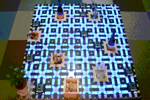

Hi there 👋, I'm Keisuke Okumura (kei18), a researcher interested in multi-agent & multi-robot systems.

[Homepage](https://kei18.github.io/) /
[Publications](https://scholar.google.co.jp/citations?user=4dFSWwMAAAAJ) /
[LinkedIn](https://www.linkedin.com/in/kei18/) /
[X](https://x.com/_kei18)

        

## Research Utils

